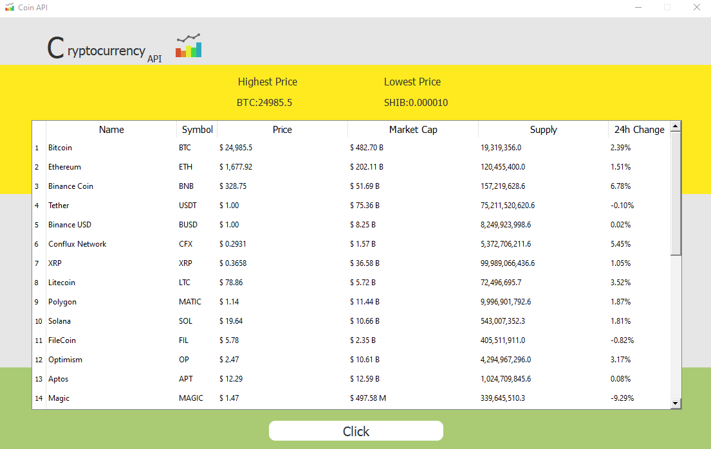

## crypto api
Get a number of top coins by their total volume across all markets in the last 24 hours form https://min-api.cryptocompare.com/

### Required packages
+ python 3.9
+ pip install PyQt5
+ pip install PyMySQL
+ pip install requests

